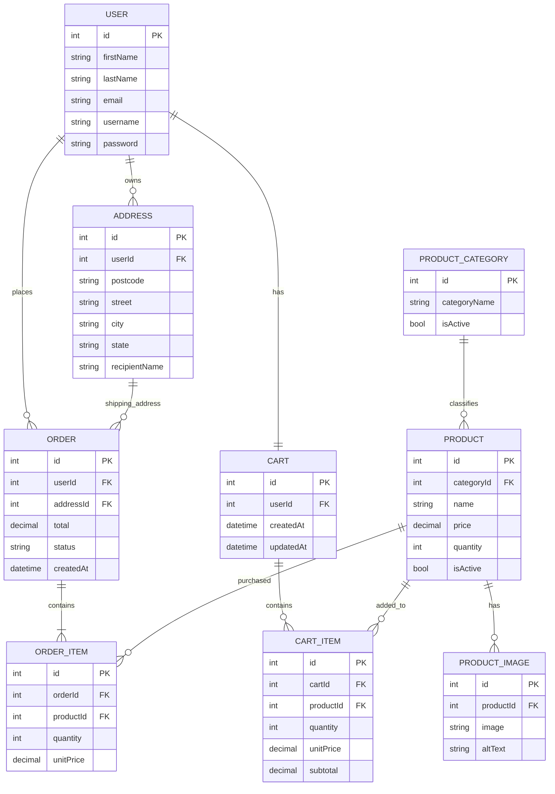

```mermaid
erDiagram

    USER {
        int id PK
        string firstName
        string lastName
        string email
        string username
        string password
    }

    ADDRESS {
        int id PK
        int userId FK
        string postcode
        string street
        string city
        string state
        string recipientName
    }

    PRODUCT_CATEGORY {
        int id PK
        string categoryName
        bool isActive
    }

    PRODUCT {
        int id PK
        int categoryId FK
        string name
        decimal price
        int quantity
        bool isActive
    }

    PRODUCT_IMAGE {
        int id PK
        int productId FK
        string image
        string altText
    }

    CART {
        int id PK
        int userId FK
        datetime createdAt
        datetime updatedAt
    }

    CART_ITEM {
        int id PK
        int cartId FK
        int productId FK
        int quantity
        decimal unitPrice
        decimal subtotal
    }

    ORDER {
        int id PK
        int userId FK
        int addressId FK
        decimal total
        string status
        datetime createdAt
    }

    ORDER_ITEM {
        int id PK
        int orderId FK
        int productId FK
        int quantity
        decimal unitPrice
    }

    USER ||--o{ ADDRESS : owns
    USER ||--|| CART : has
    USER ||--o{ ORDER : places

    CART ||--o{ CART_ITEM : contains
    PRODUCT ||--o{ CART_ITEM : added_to

    ORDER ||--|{ ORDER_ITEM : contains
    PRODUCT ||--o{ ORDER_ITEM : purchased

    PRODUCT_CATEGORY ||--o{ PRODUCT : classifies
    PRODUCT ||--o{ PRODUCT_IMAGE : has

    ADDRESS ||--o{ ORDER : shipping_address
```